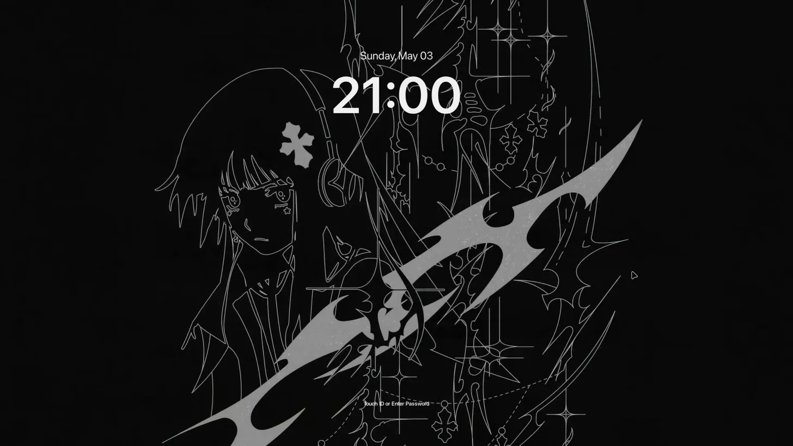

<div align="center">
# blur166
 
*dark. minimal. mine.*
 
</div>
---
 


 
---
 
## stack
 
| role | tool |
|---|---|
| os | arch linux |
| wm | hyprland + hyprscroller |
| bar | waybar |
| terminal | kitty |
| shell | zsh |
| launcher | rofi |
| notifications | swaync |
| lock screen | hyprlock |
| idle daemon | hypridle |
| wallpaper | hyprpaper + waypaper |
| file manager | dolphin |
| clipboard | cliphist |
| screenshot | grimblast + satty |
| screen recorder | gpu screen recorder |
| colors | pywal (dynamic) |
| qt theme | qt6ct + klassy |
| gtk theme | adwaita:dark |
| icons | papirus-dark |
| cursor | moga-candy-black |
| fonts | jetbrains mono nf · noto sans · google sans flex |
 
---
 
## structure
 
```
~/.config/
├── hypr/
│   └── blur166/
│       ├── hypr.conf          # entry point, sources everything
│       ├── autoruns.conf      # startup apps
│       ├── keybinds.conf      # keybindings
│       ├── windows.conf       # window rules, animations, gaps
│       ├── monitors.conf      # monitor layout
│       ├── environment.conf   # env vars, variables
│       ├── input.conf         # keyboard, mouse
│       ├── hypridle.conf      # idle config
│       ├── hyprlock.conf      # lock screen
│       └── workspaces.conf    # workspace rules
├── waybar/
│   └── blur166/
│       ├── config.jsonc       # bar layout
│       ├── style.css          # bar style
│       └── scripts/           # weather, music, mic scripts
└── swaync/
    ├── config.json            # notification center
    └── style.css              # notification style
```
 
---
 
## keybinds
 
| keys | action |
|---|---|
| `super + q` | open terminal |
| `super + c` | close window |
| `super + r` | open rofi |
| `super + e` | open file manager |
| `super + z` | toggle floating |
| `super + l` | lock screen |
| `super + v` | clipboard history |
| `super + shift + s` | screenshot (area) |
| `super + arrows` | move focus |
| `super + 1-9` | switch workspace |
| `super + shift + 1-9` | move window to workspace |
 
---
 
## notes
 
colors are generated dynamically by **pywal** based on the current wallpaper — so the accent colors shift with each background.
 
some parts of this config are vibe coded. it works, i don't fully understand all of it, and i'm okay with that.
